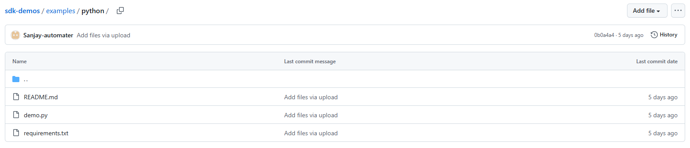
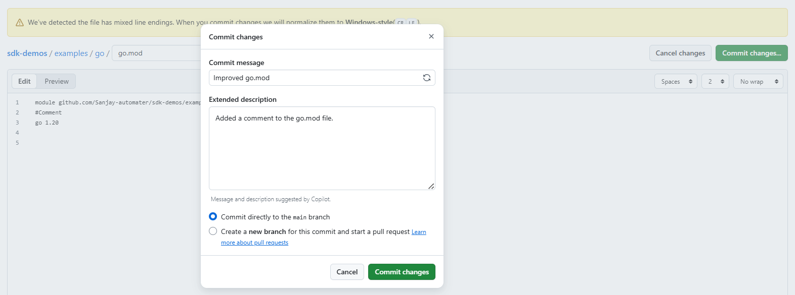
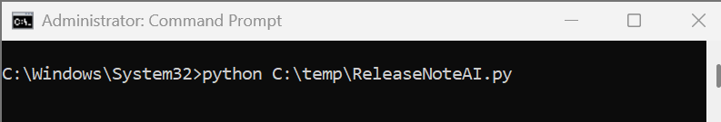
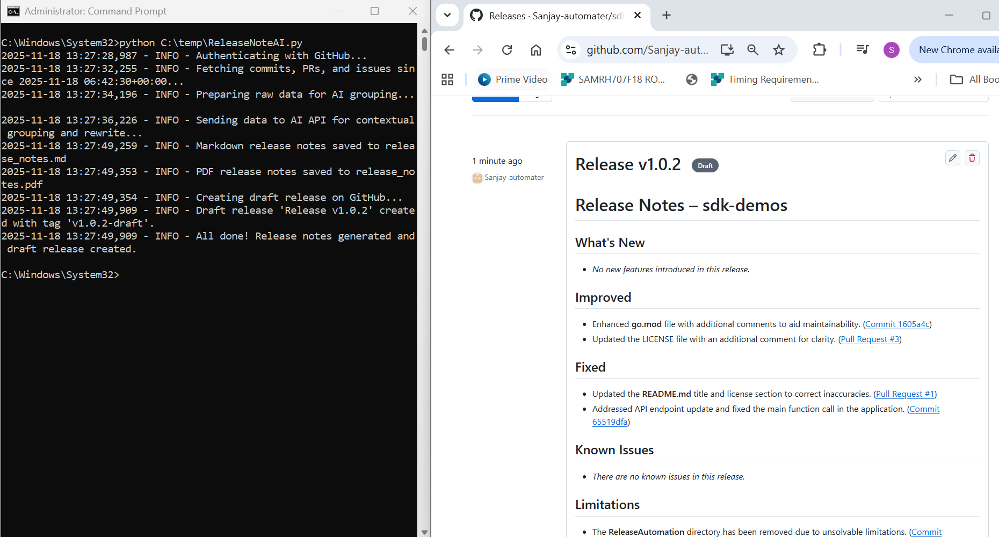

## Repository Purpose

This repository showcases an automated workflow for generating professional release notes for software projects. The core script provided here streamlines the release management process by leveraging artificial intelligence (AI) to analyze, organize, and summarize all changes made to the codebase.

### Benefits

- **Consistency:**  
  Ensures that release notes are always well-structured and professionally written, regardless of the number or type of changes.

- **Efficiency:**  
  Saves time for maintainers by automating the tedious process of compiling and formatting release notes.

- **Intelligence:**  
  Uses AI to understand the context and significance of each change, resulting in more meaningful and accurate release documentation.

## How It Works

The workflow is designed for simplicity and automation, enabling technical writers or release managers to generate professional release notes with minimal effort:

1. **Trigger the Script:**  
   The technical writer (or any authorized user) runs the provided automation script in the repository.

2. **Automated Data Collection:**  
   The script connects to GitHub and automatically gathers all information.

3. **AI-Powered Analysis and Grouping:**  
   The collected data is sent to an AI service, which analyzes each change and intelligently decides the most appropriate section for it (e.g., "Fixed", "What's New", "Improved", "Known Issues", etc.).

4. **Release Notes Generation:**  
   The AI rewrites and summarizes the content in a clear, concise, and professional style, returning a complete set of release notes.

5. **Multi-Format Output:**  
   AI-generated release notes are saved in both Markdown and PDF formats, with custom styling for enhanced readability.

---

**In short:**  
A technical writer simply triggers the script, and—boom—the draft release note is created in GitHub, ready for review and publication.

---
## Procedure: Generate AI-Powered Release Notes

Use the following procedure to generate automated, AI-powered release notes for your project.

### Step 1: Edit a Script in the Examples Folder
- Navigate to the `examples` folder.
- Open the relevant script file (such as `go.mod` or a Python file).
- Make the necessary modifications to the script.

### Step 2: Commit Your Changes
- Add a descriptive commit message and summary.
- Choose to either commit directly to the main branch or create a new branch and open a pull request.

### Step 3: Run the Automation Script Locally
- Execute the provided Python automation script from your local development environment.
- This action initiates the release note generation workflow.

### Step 4: Review the Draft Release Notes
- Upon successful execution, the script generates draft release notes.
- The draft is created in GitHub and is available for review and publication.

---

> **Note:**  
> This workflow is designed for ease of use and efficiency. By following these steps, technical writers and release managers can ensure that release notes are consistently generated, professionally formatted, and ready for publication with minimal manual effort.

---

